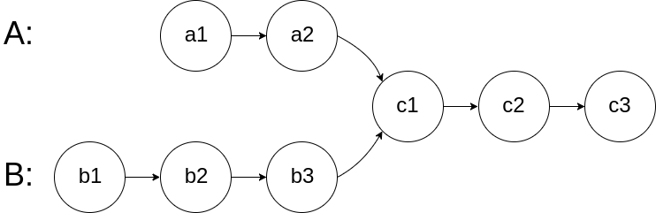
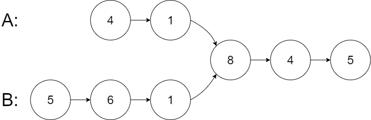
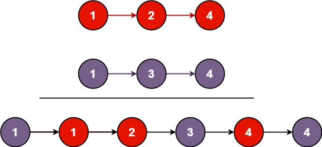
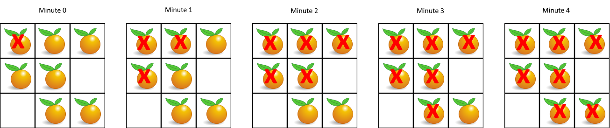

## 初级难度

### 输入处理（重要）： HJ5.进制转换

**描述**

写出一个程序，接受一个十六进制的数，输出该数值的十进制表示。

数据范围：1≤n≤2<sup>31</sup>

输入描述：输入一个十六进制的数值字符串。

输出描述：输出该数值的十进制字符串。不同组的测试用例用\n隔开。

**示例1**

```bash
0xAA #输入
170 #输出
```

**答案**

```python
print(int(input(), 16))

# 知识点:python3 中2、8、16进制转换方法bin、oct、hex
```

### 排列组合： NC61.两数之和

**描述

给出一个整型数组 numbers 和一个目标值 target，请在数组中找出两个加起来等于目标值的数的下标，返回的下标按升序排列。

（注：**返回**的数组下标从1开始算起，保证target一定可以由数组里面2个数字相加得到）

数据范围：
$$2≤len(numbers)≤10^5,−10≤numbers_i≤10^9,0≤target≤10^9$$

要求：空间复杂度 O(n)，时间复杂度O(nlogn)

```python

class Solution:
    def twoSum(self, numbers: List[int], target: int) -> List[int]:
        tmp_dict = {}
        for i in range(len(numbers)):
            if target - numbers[i] in tmp_dict.keys():
                return [tmp_dict[target - numbers[i]] + 1, i + 1]
            tmp_dict[numbers[i]] = i
```

### 快速排序： HJ3.明明的随机数

**描述

明明生成了N个1到500之间的随机整数。请你删去其中重复的数字，即相同的数字只保留一个，把其余相同的数去掉，然后再把这些数从小到大排序，按照排好的顺序输出。

数据范围:$$1≤n≤1000$$
输入的数字大小满足:$$1≤val≤500$$
**输入描述：

第一行先输入随机整数的个数 N 。 接下来的 N 行每行输入一个整数，代表明明生成的随机数。 具体格式可以参考下面的"示例"。

**输出描述：

输出多行，表示输入数据处理后的结果

```python
N = int(input())
list_1 = []
for i in range(N):
    x = int(input())
    if x not in list_1:
        list_1.append(x)
    list_1.sort()
for i in list_1:
    print(i)
```

**哈希表： HJ10.字符个数统计**
**描述**

编写一个函数，计算字符串中含有的不同字符的个数。字符在 ASCII 码范围内( 0~127 ，包括 0 和 127 )
，换行表示结束符，不算在字符里。不在范围内的不作统计。多个相同的字符只计算一次

例如，对于字符串 abaca 而言，有 a、b、c 三种不同的字符，因此输出 3 。

数据范围： $$1≤n≤500$$
**输入描述**：

输入一行没有空格的字符串。

**输出描述：

输出 输入字符串 中范围在(0~127，包括0和127)字符的种数。

```python
print(len(set(input())))
```

### 递归： NC68.跳台阶

**描述

一只青蛙一次可以跳上1级台阶，也可以跳上2级。求该青蛙跳上一个 n 级的台阶总共有多少种跳法（先后次序不同算不同的结果。

数据范围：$$1≤n≤40$$要求：时间复杂度：O(n)，空间复杂度：O(1)
**示例1

```bash
2 # 输入
2 # 输出
# 说明：青蛙要跳上两级台阶有两种跳法，分别是：先跳一级，再跳一级或者直接跳两级。因此答案为2
```

**答案**

```python
class Solution:
    def jumpFloor(self, number: int) -> int:
        if number < 4:
            return number
        else:
            list1 = [1, 2, 3]
            for i in range(3, number):
                x = list1[i - 1] + list1[i - 2]
                list1.append(x)
            return list1[-1]
```

#### HJ17.坐标移动

**描述**
开发一个坐标计算工具， A表示向左移动，D表示向右移动，W表示向上移动，S表示向下移动。从（0,0）点开始移动，从输入字符串里面读取一些坐标，并将最终输入结果输出到输出文件里面。  
***输入：***  
合法坐标为A(或者D或者W或者S)+ 数字（两位以内）
坐标之间以;分隔。
非法坐标点需要进行丢弃。如AA10; A1A; \$%$; YAD; 等。
下面是一个简单的例子如：
A10;S20;W10;D30;X;A1A;B10A11;;A10;  
***处理过程：***

```text
起点（0,0）
+   A10 = (-10,0）
+   S20 = (-10,-20)
+   W10 = (-10,-10)
+   D30 = (20,-10)
+   x = 无效
+   A1A = 无效
+   B10A11 = 无效
+  一个空不影响
+   A10 = (10,-10)
结果 (10,-10)
```

数据范围：每组输入的字符串长度满足 1≤n≤10000 ，坐标保证满足−2<sup>31</sup> ≤x, y≤2<sup>31</sup>−1 ，且数字部分仅含正数
**输入描述：**
一行字符串  
**输出描述：**
最终坐标，以逗号分隔  
**示例1**

```bash
A10;S20;W10;D30;X;A1A;B10A11;;A10; # 输入
10,-10                             # 输出
```

**答案**

```python
string = input()
str_list = string.split(';')
d = {}
for item in str_list:
    if len(item) > 1 and item[0] in list('ADSW') and item[1:].isdecimal():
        d[item[0]] = d.get(item[0], 0) + int(item[1:])
x, y = (d['D'] - d['A']), (d['W'] - d['S'])
print('%d,%d' % (x, y))
```

### HJ20.密码验证合格程序
**描述**  
密码要求:  
1.长度超过8位  
2.包括大小写字母.数字.其它符号,以上四种至少三种  
3.不能有长度大于2的包含公共元素的子串重复 （注：其他符号不含空格或换行）  
数据范围：输入的字符串长度满足 1≤n≤100  
输入描述：一组字符串。  
输出描述：如果符合要求输出：OK，否则输出NG  
**答案**
```python
while True:
    try:
        line = input()
        a = 0
        b = 0
        c = 0
        d = 0
        flag = True
        for i in line:
            if i.isdigit():
                a = 1
            elif i.islower():
                b = 1
            elif i.isupper():
                c = 1
            else:
                d = 1
        for j in range(len(line) - 3):
            if line.count(line[j:j + 3]) > 1:
                flag = False
            if len(line) > 8 and (a + b + c + d) >= 3 and flag:
                print("OK")
            else:
                print("NG")
    except:
        break
```

### \*HJ23.删除字符串中出现次数最少的字符
**描述**  
实现删除字符串中出现次数最少的字符，若出现次数最少的字符有多个，则把出现次数最少的字符都删除。输出删除这些单词后的字符串，字符串中其它字符保持原来的顺序。
数据范围：输入的字符串长度满足 1≤n≤20，保证输入的字符串中仅出现小写字母。  
输入描述：字符串只包含小写英文字母, 不考虑非法输入，输入的字符串长度小于等于20个字节。  
输出描述： 删除字符串中出现次数最少的字符后的字符串。
```python
str1 = input()
d = {}
for i in str1:
    d[i] = str1.count(i)
min = min(d.values())
for k, v in d.items():
    if v == min:
        str1 = str1.replace(k, "")
print(str1)
```
### \*HJ33.整数与 IP 地址间的转换
**描述**  
原理：ip地址的每段可以看成是一个0-255的整数，把每段拆分成一个二进制形式组合起来，然后把这个二进制数转变成
一个长整数。  
举例：一个ip地址为10.0.3.193
每段数字             相对应的二进制数  
10                   00001010  
0                    00000000  
3                    00000011  
193                  11000001
组合起来即为：00001010 00000000 00000011 11000001,转换为10进制数就是：167773121，即该IP地址转换后的数字就是它了。  
数据范围：保证输入的是合法的 IP 序列

输入描述：  
输入   
1 输入IP地址  
2 输入10进制型的IP地址

输出描述：
输出
1 输出转换成10进制的IP地址
2 输出转换后的IP地址
```python
while True:
    try:
        a=list(map(int,input().split('.')))
        b=int(input())
        c=''
        for i in a:
            s=bin(i)[2:]
            while (len(s)<8):
                s='0'+s
            c += s
        print(int(c,2))
        b=bin(b)[2:]
        while (len(b)<32):
            b= '0'+b
        print(str(int(b[0:8],2))+'.'+str(int(b[8:16],2))+'.'+str(int(b[16:24],2))+'.'+str(int(b[24:32],2)))
    except:
        break
```
### HJ101.输入整型数组和排序标识
**描述**  
输入整型数组和排序标识，对其元素按照升序或降序进行排序  
数据范围：1≤n≤1000，元素大小满足 0≤val≤100000   
输入描述：  
第一行输入数组元素个数  
第二行输入待排序的数组，每个数用空格隔开  
第三行输入一个整数0或1。0代表升序排序，1代表降序排序  
输出描述：
输出排好序的数字
```python
while True:
    try:
        a=int(input())
        b=list(map(int,input().split()))
        c=int(input())
        ans=sorted(b,reverse=c)
        res=''
        for i in ans:
            res=res+str(i)+" "
        print(res)
    except:
        break
```

### leetcode 1839 最长子字符串
**描述**  
当一个字符串满足如下条件时，我们称它是 美丽的 ：

所有 5 个英文元音字母（'a' ，'e' ，'i' ，'o' ，'u'）都必须 至少 出现一次。
这些元音字母的顺序都必须按照 字典序 升序排布（也就是说所有的 'a' 都在 'e' 前面，所有的 'e' 都在 'i' 前面，以此类推）
比方说，字符串 "aeiou" 和 "aaaaaaeiiiioou" 都是 美丽的 ，但是 "uaeio" ，"aeoiu" 和 "aaaeeeooo" 不是美丽的 。

给你一个只包含英文元音字母的字符串 word ，请你返回 word 中 最长美丽子字符串的长度 。如果不存在这样的子字符串，请返回 0 。  
**子字符串**是字符串中一个连续的字符序列。

```text
示例 1：  
输入：word = "aeiaaioaaaaeiiiiouuuooaauuaeiu"  
输出：13  
解释：最长子字符串是 "aaaaeiiiiouuu" ，长度为 13 。

示例 2：  
输入：word = "aeeeiiiioooauuuaeiou"  
输出：5  
解释：最长子字符串是 "aeiou" ，长度为 5 。

示例 3：  
输入：word = "a"  
输出：0  
解释：没有美丽子字符串，所以返回 0 。
```
**答案**
```python
class Solution:
    def longestBeautifulSubstring(self, word: str) -> int:
        if len(word) < 5: return 0
        sample = "aeiouu"
        queue = []
        mx = 0
        cnt = 0

        for i in word:
            if i == "a" and not queue:
                cnt += 1
                queue.append(i)
            elif queue:
                if len(queue) < 5 and i == sample[len(queue)]:
                    cnt += 1
                    queue.append(i)
                elif i == queue[-1]:
                    cnt += 1
                    continue
                elif i != queue[-1]:
                    if len(queue) == 5:
                        mx = max(mx, cnt)
                    queue = []
                    cnt = 0
                    if i == "a":
                        cnt+=1
                        queue.append(i)

        if len(queue) == 5:
            mx = max(mx, cnt)
        return mx
```
### HJ46 截取字符串
**描述**  
输入一个字符串和一个整数k,截取字符串前k个字符并输出  
数据范围：字符串长度满足 1≤n≤1000，1≤k≤n 
输入描述：  
1.输入待截取的字符串  
2.输入一个正整数k，代表截取的长度

输出描述：  
截取后的字符串  
**答案** 
```python
print(input()[0:int(input())])
```

### NC149 字符串匹配KMP算法
**描述**
给你一个文本串T，一个非空模板串S，问S在T中出现了多少次  
数据范围：  
1≤len(S)≤500000,1≤len(T)≤1000000  
要求：空间复杂度 O(len(S))，时间复杂度O(len(S)+len(T))  
```text
示例1
输入："ababab","abababab"
返回值：2

示例2
输入："abab","abacabab"
返回值：1
```
**答案**
```python
class Solution:
    def kmp(self , S , T ):
        ns=len(S)
        nt=len(T)
        n=0
        for i in range(nt-ns+1):
            if S[0]==T[i]:
                k=T[i:i+ns]
                if S==k:
                    n+=1
        return n
```
### NC100 字符串转换成整数
**描述**
写一个函数 StrToInt，实现把字符串转换成整数这个功能。不能使用 atoi 或者其他类似的库函数。传入的字符串可能有以下部分组成:  
1. 若干空格
2. (可选)一个符号字符（'+' 或 '-')  
3. 数字，字母，符号，空格组成的字符串表达式
4. 若干空格

转换算法如下:  
```text
1.去掉无用的前导空格   
2.第一个非空字符为+或者-号时，作为该整数的正负号，如果没有符号，默认为正数  
3.判断整数的有效部分：  
    3.1 确定符号位之后，与之后面尽可能多的连续数字组合起来成为有效整数数字，如果没有有效的整数部分，那么直接返回0  
    3.2 将字符串前面的整数部分取出，后面可能会存在存在多余的字符(字母，符号，空格等)，这些字符可以被忽略，它们对于函数不应该造成影响  
    3.3  整数超过 32 位有符号整数范围 [−231,  231 − 1] ，需要截断这个整数，使其保持在这个范围内。具体来说，小于−231的整数应该被调整为−231，大于231−1的整数应该被调整为231−1  
4.去掉无用的后导空格
```
数据范围:  
1.0 <=字符串长度<= 100  
2.字符串由英文字母（大写和小写）、数字（0-9）、' '、'+'、'-' 和 '.' 组成
```text
示例1  
输入："82"
返回值：82

示例2
输入："   -12  "
返回值：-12
说明：去掉前后的空格，为-12  

示例3
输入："4396 clearlove"
返回值：4396
说明：6后面的字符不属于有效的整数部分，去除，但是返回前面提取的有效部分

示例4
输入："clearlove 4396"
返回值：0

示例5
输入："-987654321111"
返回值：-2147483648
```
**答案**
```python
class Solution:
    def StrToInt(self , s: str) -> int:
        s = s.strip()
        if not s:
            return 0
        sign = -1 if s[0]=='-' else 1
        if s[0]=='-' or s[0] == '+':
            s = s[1:]
        num = 0
        for i in s:
            if i.isdigit():
                num *= 10
                num += ord(i) - 48
            else:
                break
        return min(max(sign*num,-2**31),2**31-1)
```
### HJ70 矩阵乘法计算量估算
**描述**
矩阵乘法的运算量与矩阵乘法的顺序强相关。  
例如：
A是一个50×10的矩阵，B是10×20的矩阵，C是20×5的矩阵  
计算A*B*C有两种顺序：((AB)C)或者(A(BC))，前者需要计算15000次乘法，后者只需要3500次。  
编写程序计算不同的计算顺序需要进行的乘法次数。  
数据范围：矩阵个数1≤n≤15, 行列数:1≤row<sub>i</sub>，col<sub>i</sub>≤100**保证给出的字符串表示的计算顺序唯一**。  
进阶：时间复杂度：O(n) ，空间复杂度：O(n)  
**输入描述：**  
输入多行，先输入要计算乘法的矩阵个数n，每个矩阵的行数，列数，总共2n的数，最后输入要计算的法则  
计算的法则为一个字符串，仅由左右括号和大写字母（'A'~'Z'）组成，保证括号是匹配的且输入合法！
**输出描述：**
输出需要进行的乘法次数  
**示例子1**
```text
输入：3
     50 10
     10 20
     20 5
     (A(BC))
输出：3500
```
**答案**
```python
while True:
    try:
        n = int(input())
        arr = []
        order = []
        res = 0
        for i in range(n):
            arr.append(list(map(int, input().split())))
        f = input()
        for i in f:
            if i.isalpha():
                order.append(arr[ord(i) - 65])
            elif i == ')' and len(order) >= 2:
                a = order.pop()
                b = order.pop()
                res += b[0] * b[1] * a[1]
                order.append([b[0], a[1]])
        print(res)
    except:
        break
```
### 合并表记录
**描述**
数据表记录包含表索引index和数值value（int范围的正整数），请对表索引相同的记录进行合并，即将相同索引的数值进行求和运算，输出按照index值升序进行输出。  

提示:  
0 <= index <= 11111111  
1 <= value <= 100000

**输入描述：**  
先输入键值对的个数n（1 <= n <= 500）  
接下来n行每行输入成对的index和value值，以空格隔开

**输出描述：**  
输出合并后的键值对（多行）

```text
输入:4
    0 1
    0 2
    1 2
    3 4
    
输出:0 3
    1 2
    3 4
```
**答案**
```python
b = {}
for i in range(int(input())):
    contents = input().split(" ")
    key, value = int(contents[0]), int(contents[1])
    b[key] = b[key] + value if key in b.keys() else value
for key in sorted(b.keys(),reverse=False):
    print(key,b[key])
```
### *HJ14.字符串排序
**描述**
给定n个字符串，请对n个字符串按照字典序排列。  
数据范围： 1≤n≤1000，字符串长度满足 1≤len≤100   
**输入描述**  
输入第一行为一个正整数n(1≤n≤1000),下面n行为n个字符串(字符串长度≤100),字符串中只含有大小写字母。  
**输出描述**  
数据输出n行，输出结果为按照字典序排列的字符串。
```text
输入:9
    cap
    to
    cat
    card
    two
    too
    up
    boat
    boot
输出:
    boat
    boot
    cap
    card
    cat
    to
    too
    two
    up
```
**答案**  
```python
l=list()
for i in range(int(input())):
    l.append(input())
l.sort(key=str)
for i in l:
    print(i)
```
### HJ27.查找兄弟单词
**描述**  
定义一个单词的“兄弟单词”为：交换该单词字母顺序（注：可以交换任意次），而不添加、删除、修改原有的字母就能生成的单词。  
兄弟单词要求和原来的单词不同。例如： ab 和 ba 是兄弟单词。 ab 和 ab 则不是兄弟单词。  
现在给定你 n 个单词，另外再给你一个单词 x ，让你寻找 x 的兄弟单词里，按字典序排列后的第 k 个单词是什么？  
**注意：** 字典中可能有重复单词。  

**数据范围：**  
1≤n≤1000,输入的字符串长度满足 1≤len(str)≤10,1≤k<n   
输入描述：  
输入只有一行。 先输入字典中单词的个数n，再输入n个单词作为字典单词。 然后输入一个单词x 最后后输入一个整数k  
输出描述：  
第一行输出查找到x的兄弟单词的个数m 第二行输出查找到的按照字典顺序排序后的第k个兄弟单词，没有符合第k个的话则不用输出。  
**示例：**
```bash
输入：3 abc bca cab abc 1
输出：2
     bca
```
**答案**  
```python
while True:
    try:
        ss=input().split()
        n=int(ss[0])
        dict=ss[1:n+1]
        s=ss[-2]
        m=int(ss[-1])
        a=[]
        for i in dict:
            if len(i)==len(s) and i!=s and sorted(i)==sorted(s):
                a.append(i)
        print(len(a))
        if a and m<=len(a):
            print(sorted(a)[m-1])
    except:
        break
```
### *NC37.合并区间
**描述**  
给出一组区间，请合并所有重叠的区间。
请保证合并后的区间按区间起点升序排列。

数据范围：区间组数 0≤n≤2×10<sup>5</sup>，区间内的值都满足 0≤val≤2×10<sup>5</sup>  
要求：空间复杂度O(n)，时间复杂度O(nlogn)  
进阶：空间复杂度O(val)，时间复杂度O(val)
**示例1**
```text
输入:       [[10,30],[20,60],[80,100],[150,180]]
返回值:     [[10,60],[80,100],[150,180]]
```
**答案**
```python
class Solution:
    def merge(self , intervals: List[Interval]) -> List[Interval]:
        if not intervals:
            return []
        intervals.sort(key = lambda x :x.start)
        res = [intervals[0]]
         
        for i in intervals[1:]:
            if i.start > res[-1].end:
                res.append(i)
            elif i.end >= res[-1].end:
                res[-1].end = i.end
        return res
```
### *HJ68.成绩排序
**描述** 
给定一些同学的信息（名字，成绩）序列，请你将他们的信息按照成绩从高到低或从低到高的排列,相同成绩  

都按先录入排列在前的规则处理。  

例示：  
jack      70  
peter     96  
Tom       70  
smith     67  

从高到低  成绩  
peter     96  
jack      70  
Tom       70  
smith     67  

从低到高  
smith     67  
jack      70  
Tom       70  
peter     96  

注：0代表从高到低，1代表从低到高  

数据范围：人数：1≤n≤200 
进阶：时间复杂度：O(nlogn) ，空间复杂度：O(n)  
**输入描述：**  
第一行输入要排序的人的个数n，第二行输入一个整数表示排序的方式，之后n行分别输入他们的名字和成绩，以一个空格隔开

**输出描述：**  
按照指定方式输出名字和成绩，名字和成绩之间以一个空格隔开
**示例**
```bash
输入：3
     0
     fang 90
     yang 50
     ning 70
输出：fang 90
     ning 70
     yang 50
```
**答案** 
```python
while True:
    try:
        num = int(input())
        flag = False if int(input().strip()) == 1 else True
        out = []
        for i in range(num):
            info = input().split()
            out.append((info[0],int(info[1])))
        for j in sorted(out,key=lambda x:x[1],reverse=flag):
            print(j[0],j[1]) 
    except:
        break
```
### HJ65 查找两个字符串a,b中的最长公共子串
**描述**
查找两个字符串a,b中的最长公共子串。若有多个，输出在较短串中最先出现的那个。  
注：子串的定义：将一个字符串删去前缀和后缀（也可以不删）形成的字符串。请和“子序列”的概念分开！  

数据范围：字符串长度1≤length≤300 
进阶：时间复杂度：O(n<sup>3</sup>) ，空间复杂度：O(n) 
**输入描述** 
输入两个字符串
**输出描述**
返回重复出现的字符
**示例** 
```bash
输入：abcdefghijklmnop
     abcsafjklmnopqrstuvw
输出：jklmnop
```
**答案**
```python
while True:
    try:
        str1=input()
        str2=input()
        n = 0
        s = ''
        if len(str1)>len(str2):
            str1,str2 = str2, str1
        for i in range(len(str1)+1):
            if str1[i-n:i] in str2:
                s = str1[i-n:i]
                n +=1
        print(s)
    except:
        break
```
###  JZ4 二维数组中的查找
**描述**  
在一个二维数组array中（每个一维数组的长度相同），每一行都按照从左到右递增的顺序排序，每一列都按照从上到下递增的顺序排序。请完成一个函数，输入这样的一个二维数组和一个整数，判断数组中是否含有该整数。  
**示列1**
```bash
输入： 7,[[1,2,8,9],[2,4,9,12],[4,7,10,13],[6,8,11,15]]

返回值： true

说明： 存在7，返回true  
```
**答案**
```python
class Solution:
    def Find(self , target: int, array: List[List[int]]) -> bool:
        if len(array) == 0:
            return False
        elif len(array[0]) == 0:
            return False
        else:
            m,n = len(array),len(array[0])
            for i in range(m):
                if array[i][0] > target:
                    break
                if array[i][n-1] < target:
                    continue
                else:
                    for item in array[i]:
                        if item == target:
                            return True
            return False
```
### NC52 有效括号序列
**描述**  
给出一个仅包含字符'(',')','{','}','['和']',的字符串，判断给出的字符串是否是合法的括号序列
括号必须以正确的顺序关闭，"()"和"()[]{}"都是合法的括号序列，但"(]"和"([)]"不合法。

数据范围：字符串长度0≤n≤10000  
要求：空间复杂度O(n)，时间复杂度O(n)  
**示例**
```bash
输入："["
返回：false
```
**答案**
```python
class Solution:
    def isValid(self , s ):
        # write code here
        #长度为奇数 一定不对
        if len(s)%2 == 1:
            return False
        #只有3种括号在s中，才进行替换
        while '{}' in s or '[]' in s or '()' in s:
            s = s.replace('[]','').replace('{}','').replace('()','')
        return True if s=='' else False
```
### *leetcode 1614. 括号的最大嵌套深度
**描述**  
如果字符串满足以下条件之一，则可以称之为 有效括号字符串（valid parentheses string，可以简写为 VPS）：  

字符串是一个空字符串 ""，或者是一个不为 "(" 或 ")" 的单字符。  
字符串可以写为 AB（A 与 B 字符串连接），其中 A 和 B 都是**有效括号字符**。  
字符串可以写为 (A)，其中 A 是一个**有效括号字符串**。  
类似地，可以定义任何有效括号字符串 S 的**嵌套深度**depth(S)：  

depth("") = 0  
depth(C) = 0，其中 C 是单个字符的字符串，且该字符不是 "(" 或者 ")"  
depth(A + B) = max(depth(A), depth(B))，其中 A 和 B 都是**有效括号字符串**  
depth("(" + A + ")") = 1 + depth(A)，其中 A 是一个**有效括号字符串**  
例如：""、"()()"、"()(()())" 都是**有效括号字符串**（嵌套深度分别为 0、1、2），而 ")(" 、"(()" 都不是**有效括号字符串**。  

给你一个**有效括号字符串** s，返回该字符串的 s **嵌套深度**。  
```python
class Solution(object):
    def maxDepth(self, s):
        stack, cnt = 0, 0
        for c in s:
            if c == '(':
                stack += 1
                cnt = max(cnt, stack)
            elif c == ')':
                stack -= 1
        return cnt        
```
**示例1**
```text
输入：s = "(1+(2*3)+((8)/4))+1"
输出：3
解释：数字 8 在嵌套的 3 层括号中。
```
**答案** 
```python
class Solution:
    def maxDepth(self, s: str) -> int:
        ans, size = 0, 0
        for ch in s:
            if ch == '(':
                size += 1
                ans = max(ans, size)
            elif ch == ')':
                size -= 1
        return ans
```
### 合法的括号字符串
**描述**
给定一个字符串s，字符串s只包含以下三种字符: (，*，)，请你判断 s是不是一个合法的括号字符串。合法括号字符串有如下规则:
1.左括号'('必须有对应的右括号')'
2.右括号')'必须有对应的左括号'('
3.左括号必须在对应的右括号前面
4.*可以视为单个左括号，也可以视为单个右括号，或者视为一个空字符
5.空字符串也视为合法的括号字符串

数据范围:1<=s.length<=100
**示例**
```bash
输入："()()"
返回值：true

输入："((*)"
返回值：true
```
**答案**
```python
#
# 代码中的类名、方法名、参数名已经指定，请勿修改，直接返回方法规定的值即可
#
# 
# @param s string字符串 
# @return bool布尔型
#
class Solution:
    def isValidString(self , s: str) -> bool:
        left_min = left_max = 0
        
        for ch in s:
            if ch == '(':
                left_min += 1
                left_max += 1
            elif ch == ')':
                left_min -= 1
                left_max -= 1
            else:
                left_min -= 1
                left_max += 1
            
            if left_max < 0:
                return False
            
            if left_min < 0:
                left_min = 0

        return left_min == 0  
```

### Leetcode 面试题 08.08. 有重复字符串的排列组合
**描述**
有重复字符串的排列组合。编写一种方法，计算某字符串的所有排列组合。
**示例**
```bash
 输入：S = "qqe"
 输出：["eqq","qeq","qqe"]
 ```
 **答案**
```python

class Solution:
    def permutation(self, S: str) -> List[str]:
        return list(set(''.join(tmp)  for tmp in itertools.permutations(S,len(S))))
```

### Leectcode 77.组合
**描述**
给定两个整数 n 和 k，返回范围 [1, n] 中所有可能的 k 个数的组合。

你可以按 任何顺序 返回答案。
**示例**
```bash
输入：n = 4, k = 2
输出：
[
  [2,4],
  [3,4],
  [2,3],
  [1,2],
  [1,3],
  [1,4],
]
```
**答案**
```python
class Solution:
    def combine(self, n: int, k: int) -> List[List[int]]:
        return list(itertools.combinations(range(1, n+1), k))
```

### Leetcode 674
**描述**  
给定一个未经排序的整数数组，找到最长且 连续递增的子序列，并返回该序列的长度。

连续递增的子序列 可以由两个下标 l 和 r（l < r）确定，如果对于每个 l <= i < r，都有 nums[i] < nums[i + 1] ，那么子序列 [nums[l], nums[l + 1], ..., nums[r - 1], nums[r]] 就是连续递增子序列。  
**示例**
```bash
输入：nums = [1,3,5,4,7]
输出：3
解释：最长连续递增序列是 [1,3,5], 长度为3。
尽管 [1,3,5,7] 也是升序的子序列, 但它不是连续的，因为 5 和 7 在原数组里被 4 隔开。 
```
**答案**
```python
class Solution:
    def findLengthOfLCIS(self, nums: List[int]) -> int:
        from math import inf
        res=0
        idx=0
        nums.append(-inf)
        for i in range(1,len(nums)):
            if nums[i]<=nums[i-1]:
                res=max(res,i-idx)
                idx=i
        return res
```
### NC17 最长回文子串
**描述**  
对于长度为n的一个字符串A（仅包含数字，大小写英文字母），请设计一个高效算法，计算其中最长回文子串的长度。

数据范围1≤n≤1000
要求: 空间复杂度O(1)，时间复杂度O(n<sup>2</sup>)
进阶: 空间复杂度 O(n)，时间复杂度 O(n)  
**示例**
```bash
输入："ababc"
返回值：3
```
**答案**
```python
class Solution:
    def getLongestPalindrome(self , A: str) -> int:
        s = list(A)
        if s == s[::-1]: return len(s)
        l, max_length = 0, 1
        for i in range(1, len(s)):
            even = s[i - max_length:i + 1]
            odd = s[i - max_length - 1:i + 1]
            if i - max_length >= 0 and even == even[::-1]:
                l = i - max_length
                max_length += 1
            if i - max_length - 1 >= 0 and odd == odd[::-1]:
                l = i - max_length - 1
                max_length += 2
        return max_length
```
### NC28 最小覆盖子串
**描述**  
给出两个字符串 s 和 t，要求在 s 中找出最短的包含 t 中所有字符的连续子串。

数据范围：0≤∣S∣,∣T∣≤10000，保证s和t字符串中仅包含大小写英文字母  
要求：进阶：空间复杂度O(n)，时间复杂度O(n)  
例如：  
S="XDOYEZODEYXNZ"  
T="XYZ"  
找出的最短子串为"YXNZ".  

注意：  
如果 s 中没有包含 t 中所有字符的子串，返回空字符串 “”；  
满足条件的子串可能有很多，但是题目保证满足条件的最短的子串唯一。   
**示例**
```bash
输入："XDOYEZODEYXNZ","XYZ"
返回值："YXNZ"
```
**答案**
```python
class Solution:
    def minWindow(self , S: str, T: str) -> str:
        # write code here
        needcnt: int = len(T)
        import collections
        need = collections.defaultdict(int)
        for c in T:
            need[c] += 1
        res = (0, float('inf'))

        i = 0
        for j, c in enumerate(S):
            if need[c] > 0:
                needcnt -= 1
            need[c] -= 1

            if needcnt == 0:
                while True:
                    c1 = S[i]
                    if need[c1] == 0:
                        break
                    need[c1] += 1
                    i += 1

                if j - i < res[1] - res[0]:
                    res = (i, j)
                
                need[S[i]] += 1
                needcnt += 1
                i += 1
        return '' if res[1] > len(S) else S[res[0] : res[1] + 1]
```
### 称砝码
**描述**  
现有n种砝码，重量互不相等，分别为 m1,m2,m3…mn ；  
每种砝码对应的数量为 x1,x2,x3...xn 。现在要用这些砝码去称物体的重量(放在同一侧)，问能称出多少种不同的重量。

注：  
称重重量包括 0

数据范围：每组输入数据满足 1≤n≤10，1≤m<sub>i</sub>≤2000，1≤x<sub>i</sub>≤10   
**输入描述：**  
对于每组测试数据：  
第一行：n --- 砝码的种数(范围[1,10])  
第二行：m1 m2 m3 ... mn --- 每种砝码的重量(范围[1,2000])  
第三行：x1 x2 x3 .... xn --- 每种砝码对应的数量(范围[1,10])  
**输出描述：**  
利用给定的砝码可以称出的不同的重量数  
**示例**
```bash
输入：2
     1 2
     2 1
输出：5
说明：可以表示出0，1，2，3，4五种重量。   
```
**答案**
```python
n_weights = int(input())
weights = [int(w) for w in input().split()]
nums = [int(i) for i in input().split()]

# credits to wfj
def count_different_weights(n, weight_lst, count_lst):
    exist_weights = {0}
    for w, c in zip(weight_lst, count_lst):
        need_try_to_add_one = exist_weights
        for i in range(c):
            need_try_to_add_more = []
            for wi in need_try_to_add_one:
                wi += w
                if wi not in exist_weights:
                    need_try_to_add_more.append(wi)
            need_try_to_add_one = need_try_to_add_more
            exist_weights.update(need_try_to_add_one)
    return len(exist_weights)

result = count_different_weights(n_weights, weights, nums)
print(result)
```
### *剑指 Offer 32 - II. 从上到下打印二叉树 II
**描述**  
从上到下按层打印二叉树，同一层的节点按从左到右的顺序打印，每一层打印到一行。

例如:
给定二叉树: [3,9,20,null,null,15,7],
```text
    3
   / \
  9  20
    /  \
   15   7
```
返回其层次遍历结果：
```text
[
  [3],
  [9,20],
  [15,7]
]
```
提示：节点总数 <= 1000
**答案**
```python
class Solution:
    def levelOrder(self, root: TreeNode) -> List[List[int]]:
        if not root: return []
        res, queue = [], collections.deque()
        queue.append(root)
        while queue:
            tmp = []
            for _ in range(len(queue)):
                node = queue.popleft()
                tmp.append(node.val)
                if node.left: queue.append(node.left)
                if node.right: queue.append(node.right)
            res.append(tmp)
        return res
```
### 剑指 Offer 32 - III. 从上到下打印二叉树 III
**描述**  
请实现一个函数按照之字形顺序打印二叉树，即第一行按照从左到右的顺序打印，第二层按照从右到左的顺序打印，第三行再按照从左到右的顺序打印，其他行以此类推。  
例如:  
给定二叉树: [3,9,20,null,null,15,7],
```text
    3
   / \
  9  20
    /  \
   15   7
```
返回其层次遍历结果：
```text
[
  [3],
  [20,9],
  [15,7]
]
```
**答案**
```python
class Solution:
    def levelOrder(self, root: TreeNode) -> List[List[int]]:
        if not root: return []
        res, deque = [], collections.deque([root])
        while deque:
            tmp = collections.deque()
            for _ in range(len(deque)):
                node = deque.popleft()
                if len(res) % 2: tmp.appendleft(node.val) # 偶数层 -> 队列头部
                else: tmp.append(node.val) # 奇数层 -> 队列尾部
                if node.left: deque.append(node.left)
                if node.right: deque.append(node.right)
            res.append(list(tmp))
        return res
```
### HJ48 从单向链表中删除指定值的节点
**描述**  
输入一个单向链表和一个节点的值，从单向链表中删除等于该值的节点，删除后如果链表中无节点则返回空指针。

链表的值不能重复。

构造过程，例如输入一行数据为:  
6 2 1 2 3 2 5 1 4 5 7 2 2  
则第一个参数6表示输入总共6个节点，第二个参数2表示头节点值为2，剩下的2个一组表示第2个节点值后面插入第1个节点值，为以下表示:  
1 2 表示为  
2->1  
链表为2->1  

3 2表示为  
2->3  
链表为2->3->1

5 1表示为  
1->5  
链表为2->3->1->5

4 5表示为  
5->4  
链表为2->3->1->5->4

7 2表示为  
2->7  
链表为2->7->3->1->5->4

最后的链表的顺序为 2 7 3 1 5 4

最后一个参数为2，表示要删掉节点为2的值  
删除 结点 2

则结果为 7 3 1 5 4

数据范围：链表长度满足1≤n≤1000 ，节点中的值满足 0≤val≤10000 

测试用例保证输入合法

**输入描述：**  
输入一行，有以下4个部分：  
1 输入链表结点个数  
2 输入头结点的值  
3 按照格式插入各个结点  
4 输入要删除的结点的值  

**输出描述：** 
输出一行
输出删除结点后的序列，每个数后都要加空格
```bash
输入：
    5 2 3 2 4 3 5 2 1 4 3
输出：
    2 5 4 1
说明：
    形成的链表为2->5->3->4->1
    删掉节点3，返回的就是2->5->4->1  
```
**答案**
```python
while True:
    try:
        string = list(map(int, input().split()))
        link = []  # 链表
        link.append(string[1])  # 表头
        for i in range(1, string[0]):
            link.insert(link.index(string[2*i+1]) + 1, string[2*i])
        
        link.remove(string[-1])
        print(' '.join(map(str, link)))
    except:
        break
```
### Leetcode 160. 相交链表
**描述**
给你两个单链表的头节点 headA 和 headB ，请你找出并返回两个单链表相交的起始节点。如果两个链表不存在相交节点，返回 null 。

图示两个链表在节点 c1 开始相交：



题目数据 保证 整个链式结构中不存在环。

注意，函数返回结果后，链表必须 保持其原始结构 。

自定义评测：

评测系统 的输入如下（你设计的程序 不适用 此输入）：

intersectVal - 相交的起始节点的值。如果不存在相交节点，这一值为 0  
listA - 第一个链表  
listB - 第二个链表  
skipA - 在 listA 中（从头节点开始）跳到交叉节点的节点数  
skipB - 在 listB 中（从头节点开始）跳到交叉节点的节点数  
评测系统将根据这些输入创建链式数据结构，并将两个头节点 headA 和 headB 传递给你的程序。如果程序能够正确返回相交节点，那么你的解决方案将被 视作正确答案。  
**示例**

```text
输入：intersectVal = 8, listA = [4,1,8,4,5], listB = [5,6,1,8,4,5], skipA = 2, skipB = 3
输出：Intersected at '8'
解释：相交节点的值为 8 （注意，如果两个链表相交则不能为 0）。
从各自的表头开始算起，链表 A 为 [4,1,8,4,5]，链表 B 为 [5,6,1,8,4,5]。
在 A 中，相交节点前有 2 个节点；在 B 中，相交节点前有 3 个节点。
— 请注意相交节点的值不为 1，因为在链表 A 和链表 B 之中值为 1 的节点 (A 中第二个节点和 B 中第三个节点) 是不同的节点。换句话说，它们在内存中指向两个不同的位置，而链表 A 和链表 B 中值为 8 的节点 (A 中第三个节点，B 中第四个节点) 在内存中指向相同的位置。
```
**提示：**  
listA 中节点数目为 m  
listB 中节点数目为 n  
1 <= m, n <= 3 * 104  
1 <= Node.val <= 105  
0 <= skipA <= m  
0 <= skipB <= n  
如果 listA 和 listB 没有交点，intersectVal 为 0  
如果 listA 和 listB 有交点，intersectVal == listA[skipA] == listB[skipB]  
 

**进阶：** 你能否设计一个时间复杂度 O(m + n) 、仅用 O(1) 内存的解决方案？   
**答案**
```python
class Solution:
    def getIntersectionNode(self, headA: ListNode, headB: ListNode) -> ListNode:
        A, B = headA, headB
        while A != B:
            A = A.next if A else headB
            B = B.next if B else headA
        return A
```
### Leetcode 21. 合并两个有序链表
**描述**  
将两个升序链表合并为一个新的 升序 链表并返回。新链表是通过拼接给定的两个链表的所有节点组成的。 
**示例 1：**

```text
输入：l1 = [1,2,4], l2 = [1,3,4]
输出：[1,1,2,3,4,4]
```
**提示：**
两个链表的节点数目范围是 [0, 50]  
-100 <= Node.val <= 100  
l1 和 l2 均按 非递减顺序 排列  
**答案**
```python
class Solution:
    def mergeTwoLists(self, l1: ListNode, l2: ListNode) -> ListNode:
        if not l1: return l2  # 终止条件，直到两个链表都空
        if not l2: return l1
        if l1.val <= l2.val:  # 递归调用
            l1.next = self.mergeTwoLists(l1.next,l2)
            return l1
        else:
            l2.next = self.mergeTwoLists(l1,l2.next)
            return l2
```
### Leetcode 994. 腐烂的橘子
**描述**
在给定的 m x n 网格 grid 中，每个单元格可以有以下三个值之一：

值 0 代表空单元格；  
值 1 代表新鲜橘子；  
值 2 代表腐烂的橘子。  
每分钟，腐烂的橘子 周围 4 个方向上相邻 的新鲜橘子都会腐烂。

返回 直到单元格中没有新鲜橘子为止所必须经过的最小分钟数。如果不可能，返回 -1 。  
**示例 1：**

```text
输入：grid = [[2,1,1],[1,1,0],[0,1,1]]
输出：4
```
提示：

m == grid.length  
n == grid[i].length  
1 <= m, n <= 10  
grid[i][j] 仅为 0、1 或 2  
*答案**
```python
class Solution:
    def orangesRotting(self, grid: List[List[int]]) -> int:
        row = len(grid)
        col = len(grid[0])
        rotten = {(i, j) for i in range(row) for j in range(col) if grid[i][j] == 2} # 腐烂集合
        fresh = {(i, j) for i in range(row) for j in range(col) if grid[i][j] == 1}  # 新鲜集合
        time = 0
        while fresh:
            if not rotten: return -1
            rotten = {(i + di, j + dj) for i, j in rotten for di, dj in [(0, 1), (0, -1), (1, 0), (-1, 0)] if (i + di, j + dj) in fresh} # 即将腐烂的如果在新鲜的集合中，就将它腐烂
            fresh -= rotten # 剔除腐烂的
            time += 1
        return time
```
### 204. 计数质数
**描述**  
给定整数 n ，返回 所有小于非负整数 n 的质数的数量 。
**示例 1：**
```text
输入：n = 10
输出：4
解释：小于 10 的质数一共有 4 个, 它们是 2, 3, 5, 7 。
```
提示：0 <= n <= 5 * 106
**答案**
```python
def count_primes_py(n):
    """
    求n以内的所有质数个数（纯python代码）
    """
    # 最小的质数是 2
    if n < 2:
        return 0

    isPrime = [1] * n
    isPrime[0] = isPrime[1] = 0   # 0和1不是质数，先排除掉

    # 埃式筛，把不大于根号 n 的所有质数的倍数剔除
    for i in range(2, int(n ** 0.5) + 1):
        if isPrime[i]:
            isPrime[i * i:n:i] = [0] * ((n - 1 - i * i) // i + 1)

    return sum(isPrime)
```
### Leetcode 剑指 Offer 61. 扑克牌中的顺子
**描述**  
从若干副扑克牌中随机抽 5 张牌，判断是不是一个顺子，即这5张牌是不是连续的。2～10为数字本身，A为1，J为11，Q为12，K为13，而大、小王为 0 ，可以看成任意数字。A 不能视为 14。  
**示例 1:**
```text
输入: [1,2,3,4,5]
输出: True
```
限制：  
数组长度为 5   
数组的数取值为 [0, 13] .  
```python
class Solution:
    def isStraight(self, nums: List[int]) -> bool:
        repeat = set()
        ma, mi = 0, 14
        for num in nums:
            if num == 0: continue # 跳过大小王
            ma = max(ma, num) # 最大牌
            mi = min(mi, num) # 最小牌
            if num in repeat: return False # 若有重复，提前返回 false
            repeat.add(num) # 添加牌至 Set
        return ma - mi < 5 # 最大牌 - 最小牌 < 5 则可构成顺子 
```
### Leetcode 322. 零钱兑换
**描述**  
给你一个整数数组 coins ，表示不同面额的硬币；以及一个整数 amount ，表示总金额。  
计算并返回可以凑成总金额所需的 最少的硬币个数 。如果没有任何一种硬币组合能组成总金额，返回 -1 。  
你可以认为每种硬币的数量是无限的。
**示例1**  
```text
输入：coins = [1, 2, 5], amount = 11
输出：3 
解释：11 = 5 + 5 + 1
```
提示：  
1 <= coins.length <= 12  
1 <= coins[i] <= 231 - 1  
0 <= amount <= 104  
**答案**  
```python
class Solution:
    def coinChange(self, coins: List[int], amount: int) -> int:
        
        n = len(coins)
        dp = [[amount+1] * (amount+1) for _ in range(n+1)]    # 初始化为一个较大的值，如 +inf 或 amount+1
        # 合法的初始化
        dp[0][0] = 0    # 其他 dp[0][j]均不合法
        
        # 完全背包：套用0-1背包【遍历硬币数目k】
        for i in range(1, n+1):                     # 第一层循环：遍历硬币
            for j in range(amount+1):               # 第二层循环：遍历背包
                for k in range(j//coins[i-1]+1):    # 第三层循环：当前硬币coin取k个 (k*coin<=amount)
                    dp[i][j] = min( dp[i][j], dp[i-1][j-k*coins[i-1]] + k )

        ans = dp[n][amount] 
        return ans if ans != amount+1 else -1
```
### Leetcode 200. 岛屿数量
**描述**  
给你一个由 '1'（陆地）和 '0'（水）组成的的二维网格，请你计算网格中岛屿的数量。  
岛屿总是被水包围，并且每座岛屿只能由水平方向和/或竖直方向上相邻的陆地连接形成。  
此外，你可以假设该网格的四条边均被水包围。  
**示例1**
```text
输入：grid = [
  ["1","1","1","1","0"],
  ["1","1","0","1","0"],
  ["1","1","0","0","0"],
  ["0","0","0","0","0"]
]
输出：1
```
提示：

m == grid.length  
n == grid[i].length  
1 <= m, n <= 300  
grid[i][j] 的值为 '0' 或 '1'  
**答案**  
```python
class Solution:
    def numIslands(self, grid: List[List[str]]) -> int:
        m = len(grid)
        n = len(grid[0])
        res = 0

        def dfs(x, y):
            if grid[x][y] == '1':
                grid[x][y] = '0'
            else:
                return
            if x > 0:
                dfs(x - 1, y)
            if x < m - 1:
                dfs(x + 1, y)
            if y > 0:
                dfs(x, y - 1)
            if y < n - 1:
                dfs(x, y + 1)
            
        for i in range(m):
            for j in range(n):
                if grid[i][j] == '1':
                    dfs(i, j)
                    res += 1
        return res
```
### HJ25 数据分类处理
**描述**  
信息社会，有海量的数据需要分析处理，比如公安局分析身份证号码、 QQ 用户、手机号码、银行帐号等信息及活动记录。

采集输入大数据和分类规则，通过大数据分类处理程序，将大数据分类输出。

数据范围：1≤I,R≤100  ，输入的整数大小满足 0≤val≤2<sup>31−1</sup> 

输入描述：
一组输入整数序列I和一组规则整数序列R，I和R序列的第一个整数为序列的个数（个数不包含第一个整数）；整数范围为0~(2^31)-1，序列个数不限

输出描述：
从R依次中取出R<i>，对I进行处理，找到满足条件的I： 

I整数对应的数字需要连续包含R<i>对应的数字。比如R<i>为23，I为231，那么I包含了R<i>，条件满足 。 

按R<i>从小到大的顺序:

(1)先输出R<i>； 

(2)再输出满足条件的I的个数； 

(3)然后输出满足条件的I在I序列中的位置索引(从0开始)； 

(4)最后再输出I。 

附加条件： 

(1)R<i>需要从小到大排序。相同的R<i>只需要输出索引小的以及满足条件的I，索引大的需要过滤掉 

(2)如果没有满足条件的I，对应的R<i>不用输出 

(3)最后需要在输出序列的第一个整数位置记录后续整数序列的个数(不包含“个数”本身)

 

序列I：15,123,456,786,453,46,7,5,3,665,453456,745,456,786,453,123（第一个15表明后续有15个整数） 

序列R：5,6,3,6,3,0（第一个5表明后续有5个整数） 

输出：30, 3,6,0,123,3,453,7,3,9,453456,13,453,14,123,6,7,1,456,2,786,4,46,8,665,9,453456,11,456,12,786

说明：

30----后续有30个整数

3----从小到大排序，第一个R<i>为0，但没有满足条件的I，不输出0，而下一个R<i>是3

6--- 存在6个包含3的I 

0--- 123所在的原序号为0 

123--- 123包含3，满足条件 

**示例** 
```text
输入：
    15 123 456 786 453 46 7 5 3 665 453456 745 456 786 453 123
    5 6 3 6 3 0
输出：
    30 3 6 0 123 3 453 7 3 9 453456 13 453 14 123 6 7 1 456 2 786 4 46 8 665 9 453456 11 456 12 786
说明：
    将序列R：5,6,3,6,3,0（第一个5表明后续有5个整数）排序去重后，可得0,3,6。
    序列I没有包含0的元素。
    序列I中包含3的元素有：I[0]的值为123、I[3]的值为453、I[7]的值为3、I[9]的值为453456、I[13]的值为453、I[14]的值为123。
    序列I中包含6的元素有：I[1]的值为456、I[2]的值为786、I[4]的值为46、I[8]的值为665、I[9]的值为453456、I[11]的值为456、I[12]的值为786。
    最后按题目要求的格式进行输出即可。 
```
**答案**
```python
try:
    while True:
        l1=input().split()[1:]
        l2=list(map(int,input().split()))[1:]
        l2=list(set(l2))
        l2.sort()
        res=[]
        l2=list(map(str,l2))
        for i in range(len(l2)):
            ans =[]
            for j in range(len(l1)):
                if l2[i] in l1[j]:
                    ans.append(str(j))
                    ans.append(l1[j])
            if ans:
                res.append(l2[i])
                res.append(str(len(ans)//2))
                res +=ans
        ss = str(len(res))+' '+' '.join(res)
        print(ss)
except:
    pass
```
### HJ29 字符串加解密
**描述** 
对输入的字符串进行加解密，并输出。

加密方法为：

当内容是英文字母时则用该英文字母的后一个字母替换，同时字母变换大小写,如字母a时则替换为B；字母Z时则替换为a；

当内容是数字时则把该数字加1，如0替换1，1替换2，9替换0；

其他字符不做变化。

解密方法为加密的逆过程。
数据范围：输入的两个字符串长度满足 1≤n≤1000  ，保证输入的字符串都是只由大小写字母或者数字组成  
**输入描述：**  
第一行输入一串要加密的密码  
第二行输入一串加过密的密码  

**输出描述：**  
第一行输出加密后的字符  
第二行输出解密后的字符   
**示例1**  
```text
输入：
    abcdefg
    BCDEFGH
输出：
    BCDEFGH
    abcdefg
``` 
**答案**
```python
while True:
    try:
        a = input()
        b = input()
        m = []
        n = []
        for c in a:
            c = str(c)
            if c == 'Z':
                c = 'a'
            elif c == 'z':
                c = 'A'
            elif c.islower():
                c = chr(ord(c)+1).upper()
            elif c.isupper():
                c = chr(ord(c)+1).lower()
            elif c == '9':
                c = '0'
            elif c.isdigit():
                c = str(int(c) + 1)
            m.append(c)
        print(''.join(m))
        for c in b:
            c = str(c)
            if c == 'a':
                c = 'Z'
            elif c == 'A':
                c = 'z'
            elif c.islower():
                c = chr(ord(c.upper())-1)
            elif c.isupper():
                c = chr(ord(c.lower())-1)
            elif c == '0':
                c = '9'
            elif c.isdigit():
                c = str(int(c) - 1)
            n.append(c)
        print(''.join(n))
    except:
        break
```
### HJ43 迷宫问题
**描述**  
定义一个二维数组 N*M ，如 5 × 5 数组下所示：


int maze[5][5] = {  
0, 1, 0, 0, 0,  
0, 1, 1, 1, 0,  
0, 0, 0, 0, 0,  
0, 1, 1, 1, 0,  
0, 0, 0, 1, 0,  
};  

它表示一个迷宫，其中的1表示墙壁，0表示可以走的路，只能横着走或竖着走，不能斜着走，要求编程序找出从左上角到右下角的路线。入口点为[0,0],既第一格是可以走的路。


数据范围：2≤n,m≤10  ， 输入的内容只包含 0≤val≤1 

**输入描述：**  
输入两个整数，分别表示二维数组的行数，列数。再输入相应的数组，其中的1表示墙壁，0表示可以走的路。数据保证有唯一解,不考虑有多解的情况，即迷宫只有一条通道。

**输出描述：**  
左上角到右下角的最短路径，格式如样例所示。
```text
输入：
    5 5
    0 1 0 0 0
    0 1 1 1 0
    0 0 0 0 0
    0 1 1 1 0
    0 0 0 1 0
输出：
    (0,0)
    (1,0)
    (2,0)
    (2,1)
    (2,2)
    (2,3)
    (2,4)
    (3,4)
    (4,4)
```
**答案**
```python
maze = []
maze_visit = []
myStack = []
move = [(0,1), (0,-1), (1,0), (-1,0)]
N, M = 0, 0
def DFS(x, y):
    
    if x <0 or x >= N or y < 0 or y >= M:
        return False
    if maze_visit[x][y] == True:
        return False
    if maze[x][y] == 1:
        return False
    maze_visit[x][y] = True
    if x == N-1 and y == M-1:
        myStack.append((x,y))
        return True
    for m in move:
        next_x = x+m[0]
        next_y = y+m[1]
        if DFS(next_x, next_y):
            myStack.append((x,y))
            return True
    return False

while True:
    try:
        maze  = []
        maze_visit = []
        myStack = []
        N, M = map(int, input().split())
        for i in range(N):
            row = input().split()
            maze.append([int(num) for num in row])
            maze_visit.append([False]*len(row))
        #print(N, M)
        #print(maze)
        #print(maze_visit)
        DFS(0,0)
        myStack = myStack[::-1]
        for row in myStack:
            print('(' + str(row[0]) + ','+ str(row[1]) + ')')
    except:
        break
```

